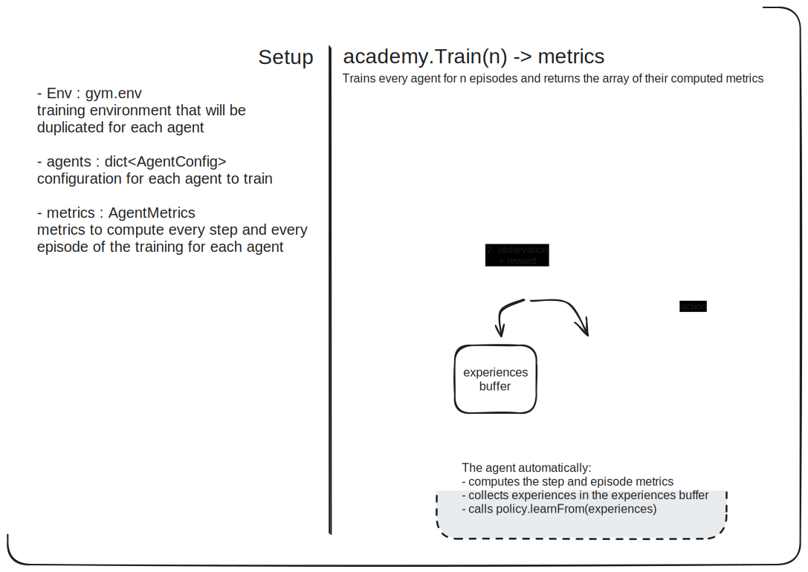

# Setup the environment
**Install WSL** 
- Install from the microsoft store:
    - Ubuntu 24.04 LTS 
    - Windows Terminal
- Open a PowerShell shell un Windows Terminal and upgrade WSL to WSL 2 (this is required for using cuda in wsl)
```powershel
wsl --set-version Ubuntu-24.04 2
```

**Install Conda on WSL**
- Open a Ubuntu 24.04 LTS shell in Windows Terminal. You'll be prompted for a password : remember it 
- Install Miniconda
```bash
mkdir -p ~/miniconda3
wget --no-check-certificate https://repo.anaconda.com/miniconda/Miniconda3-latest-Linux-x86_64.sh -O ~/miniconda3/miniconda.sh
bash ~/miniconda3/miniconda.sh -b -u -p ~/miniconda3
rm -rf ~/miniconda3/miniconda.sh
```

- Set conda up for the bash shell 
```bash
~/miniconda3/bin/conda init bash
```

- Close & reopen the ubuntu shell. Your prompt should now look like `(base) user@host:~$`. This means you're currently in the "base" environment.

**Create the virtual environment**  
- Open a Ubuntu 24.04 LTS shell in Windows Terminal
- Install those required dependencies:
```bash
sudo apt update
sudo apt install gcc g++ swig
```
- cd to the folder of the project (`cd /mnt/` to get to the windows file system)
- Create the virtual environment
```bash
conda env create --file environment.yaml -n gymenv
```
- If you get errors concerning CUDA, install it and try again
```bash 
conda install cuda -c nvidia
```

# Work on the project

## Get the project running  
- Open a `Ubuntu 24.04 LTS` shell in Windows Terminal
- Activate the environment 
```bash
conda activate gym
```
- cd to the folder of the project (`cd /mnt/` to see the windows file system)
- Open vscode in the folder
```bash
code .
```
- In jupiter notebooks, use the `gym (python3.10)` kernel (install the 'Jupyter' VSCode extension if no kernel is detected)

## Create a new policy
1. Create a new file in `./markov/Policies/` named `MyPolicy.py`
2. In this new file, create a class `MyPolicy` that extends `markov.Policies.Policy`
3. Add the `from .MyPolicy import MyPolicy` to `./markov/Policies/__init__.py`  

# Documentation
## Reinforcement Learning principles

### Core principles
- A **environment** takes in *actions* and spits out a *state* that is the direct result of the action, and a *reward*. 
- A **policy** is a mapping from *states* to *actions*.
- Optimizing a policy means finding the parameters that will result in the actions that yield the most rewards.
- All policies learn from **experiences**. An experience is basically a single cycle -> `[old_state, action_taken, new_state, reward]`

### Advanced principles
- Off-policy training: when the policy we optimize and the policy used to generate the experiences are not the same. (e.g. We use a random policy to take actions, and we update a Qtable policy with the generated experiences) 
- On-policy training: when the optimized policy is the one used to take action

## Our 'markov' library
### Overview

### Policies
The most important thing is the policy : all the rest can be reused, but each policy has to be implemented in its own class. 
A policy usually defines 3 methods:
```python
def InitEnv(self, env: gym.Env):
    # overriding this method is optional, in case you need initialisation logic

def NextAction(self, state: int):
    # this method must return the next action taken by the policy 
    
def learnFromExperiences(self, experiences: list[Experience]):
    # this method updates the policy based on the received experiences  
```

Policies can be composed of multiple sub-policies. For example, the EpsilonGreedyPolicy has an exploration_policy and an exploitation_policy, which you can set to any policy you like. Each 'composed' policy must handle the propagation of the training to its sub policies. For example, when policy.learnFromExperiences(experiences) is called on a EpsilonGreedyPolicy object, it calls  exploitation_policy.learnFromExperiences(experiences)

#### UTILS
Base policies useless unless composed with other policies.

**RandomPolicy** : Takes a random action. Used as the exploration_policy for the EpsilonGreedyPolicy. 

**EpsilonGreedyPolicy**
Based on a parameter `epsilon`, the policy will take an action based either on its exploration_policy or its exploitation_policy. (`epsilon` is the probability of taking an exploration action) 

**CuriosityDrivenPolicy (TO DO):** ???

#### Q-LEARNING
QLearning is about learning the value of each action in fucntion of the current state (the Q-function is the function that returns the value of an action `a` in a state `s`)

**QTablePolicy** : Since the observation space and action space of the taxi-driver environnment are finite and discrete, the Q-function can be represented as a states*actions matrix. At each step, we update the matrix using this formula:
```python
Qtable[old_state, action] = Qtable[old_state, action] + alpha * (reward + gamma * max(Qtable[new_state]) - Qtable[old_state, action])
```  
Where:
- `alpha` is the learning rate (rate at wich the values of the table are updated)
- `gamma` is the discount factor (importance of future rewards)


**DQNPolicy (Working on it (Melvin)):** The Deep Q Network policy is usually used in cases where the observation space or action space is continuous, as it replaces the matrix of the Qtable algorithm with a neural network. The goal remains the same : estimating the value of taking an action `a` in a state `s`.

#### DYNAMIC PROGRAMMING - TO DO
No training involved : just compute the best course of action using recursion and memoization. 

#### POLICY GRADIENT METHODS
Instead of learning a value function that tells what action is best, policy gradient methods directly learn the policy function that maps state to action probabilities. The policy is optimized by gradients calculated from the expected reward. 

**PpoPolicy (Proximal Policy Optimization) - TO DO:** ???


**ReinforcePolicy (TO DO):** ???


#### ACTOR-CRITIC METHODS

**AdvantageActorCriticPolicy (A2C) (TO DO):** ???


**SoftActorCriticPolicy (SAC) (TO DO):** ???

